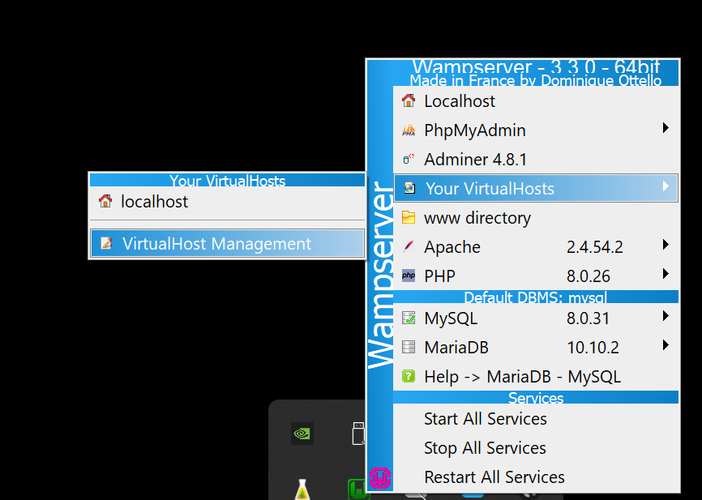
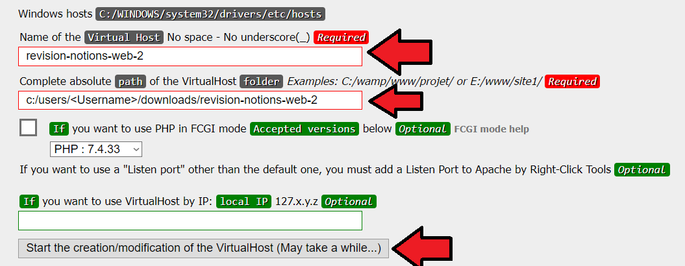

# Exercice de Révision - Notions Web 2 (WEB3)

## Configuration Générale

1. Lancez Wamp.
   - Assurez-vous que Wamp démarre correctement.
   - En cas de conflit sur le port 80 avec un autre programme que Wamp, libérez-le avec la commande `net stop http`.

2. Clonez le dépôt Git.
   - Placez-le en dehors du répertoire `www` de Wamp.
   - Ajoutez les dossiers `uploads/images/` à la racine du répertoire pour que le téléversement fonctionne.

3. Exécutez le code SQL dans MySQL Workbench.

## Routeur

- Le fichier `index.php` sert de routeur.
- En développement web 2, les requêtes ressemblaient à `index.php?action=Accueil`, explicitant le fichier `index.php` tout en passant la page ou l'action en paramètre `GET`.
- Les sites web utilisent généralement des syntaxes comme `/`, `/home`, `/accueil`, etc. Nous allons utiliser cette syntaxe pour un meilleur contrôle des accès et une syntaxe *SEO friendly*. Pour ce faire, toutes les requêtes doivent être automatiquement redirigées vers `index.php`.

### Configuration

- Ajoutez un `VirtualHost`.
  
  
- Redémarrez le DNS pour utiliser le nouveau `VirtualHost` (clic droit sur l'icone de Wamp -> `Tools` -> `Restart DNS`).
- En entrant le nom du `VirtualHost` dans l'URL, le site web devrait s'afficher.
- Le fichier [.htaccess](.htaccess) informe Apache de rediriger toutes les requêtes vers `index.php`.
  - ❗Attention : Bien que ce fichier soit utile pour tester des configurations, son utilisation, selon la documentation d'Apache, ralentit l'exécution d'Apache.

## Authentification

- L'accès à des pages autres que l'accueil, la connexion et l'inscription nécessite une connexion utilisateur.
- Complétez l'authentification de façon sécuritaire.
  

    
Indices

    <ul>
      <li>Utilisation de GET/POST</li>
      <li>password_hash/password_verify</li>
      <li>Validation côté serveur</li>
      <li>prepare et bindParam</li>
    </ul>
  

- Vérifiez immédiatement si un compte est associé lorsqu'un utilisateur entre son courriel pour s'inscrire.
  

    
Indices

    <ul>
      <li>AJAX</li>
      <li>setCustomValidity</li>
      <li>get('/api/authentification/courriel-disponible/$courriel', "verifierCourrielDisponible");</li>
    </ul>
  

## Soumission

- Les vendeurs peuvent voir les demandes de soumissions en attente.
  - Affichez toutes les demandes de soumissions en attente de manière *responsive* et sécuritaire.
    - Sur mobile, une soumission par ligne.
    - Sur tablette, deux soumissions par ligne.
    - Sur ordinateur, trois soumissions par ligne.
    

      
Indices

      <ul>
        <li>while ($data = $req->fetch())</li>
        <li>Système de grille de Bootstrap (row, col)</li>
        <li>Breakpoints (sm, md)</li>
        <li>htmlspecialchars</li>
      </ul>
    
